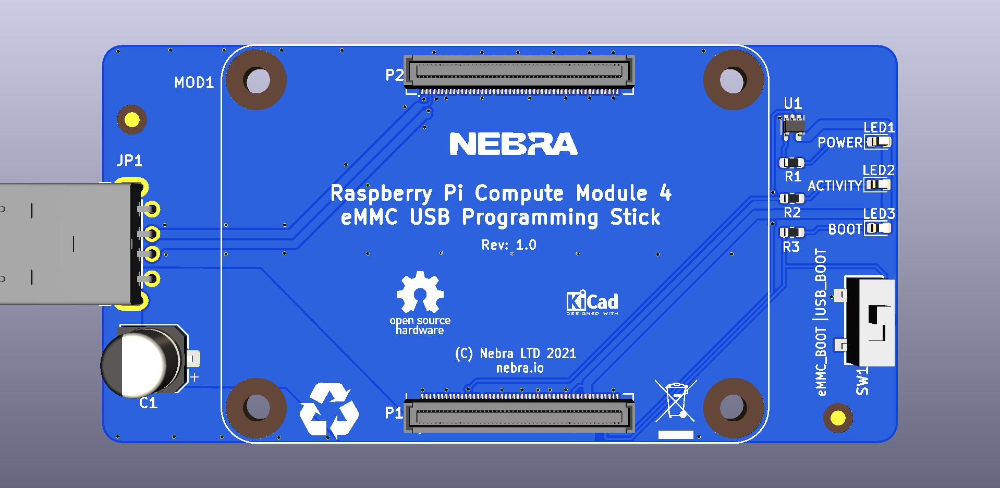

# Raspberry Pi Compute Module 4 eMMC USB Programming Stick - CM4 FlashStick

This FlashStick is designed for programming the Raspberry Pi Compute Module version 4.

# How To Use

Operation should be as simple as:

1. Insert Compute Module 4 into FlashStick.
2. Ensure switch is in position USB_BOOT.
3. Plug into Computer.
4. Load USB Boot Software (Or use Balena Etcher) to boot the CM into Programming Mode.
5. Flash image like normal.
6. Unplug stick from computer.
7. Remove Compute Module.

*Care should be taken when handling the module and CM, handle from edge to reduce risk of ESD*

# PCB Specification

* **Thickness**: 1.6mm
* **Size**: 40x80mm
* **Colour**: Whatever you like, we went for blue!
* **Surface Finish**: You'll likely find assembly easier with ENIG due to the Power ICs package.
* **Stencil**: Recommended, top only. No Frame Needed.

This PCB can be quickly ordered directly from PCB companies using the following links:
* JLCPCB - CN Based - ~ $30 -
* PCBWay - CN Based - ~ $60 -
* OSHPark - US Based - ~ $70 -
* Aisler - EU Based - ~ $55 -

Or upload the Gerbers / design files to your choice of Fab!

# Components

The BOM for shopping is in this folder.

Alternatively it's also available at [Octopart](https://octopart.com/bom-tool/03ZTTnCO) or on [Digi-key](https://www.digikey.com/short/zvwpn0)

# Assembly

We'll produce a little guide showing how we assemble them, and recommended pick and place order when doing it manually.

It's highly recommended for a Stencil to be used.

# Open Source Hardware Certification

This project is released under the [license shown here](https://github.com/NebraLtd/FlashStick/blob/main/LICENSE.md) and is also certified as [open source hardware](https://certification.oshwa.org/uk000031.html) by the [Open Source Hardware Association](https://www.oshwa.org/):

